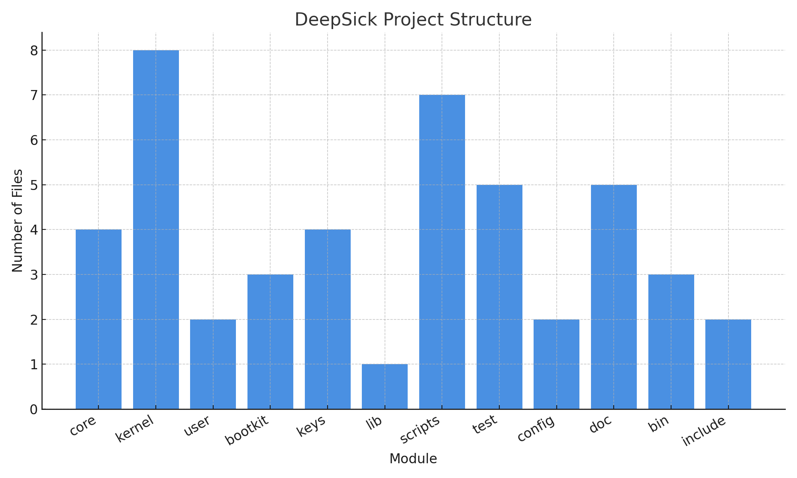

More actions
# DeepSick


---


# DeepSick — Adversarial Simulation Framework (OBLIVION SERPENT Subproject)


> “Those who understand the darkness are not those who embrace it — but those who light the way through it.”

[](SECURITY.md)
[](LICENSE)
[](https://github.com/DDW-X)

---

## 🧬 Project Lineage

> 🔥 **DeepSick** is a critical subproject of the elite cybersecurity suite **OBLIVION SERPENT** — a multi-headed initiative targeting absolute simulation and defense comprehension across digital warfare fronts.

🌐This project is still under development and will receive updates.
---

✔Current version: v10.3

⚠Previous version: v8.7

⚠Previous version: v6.6

⚠Previous version: v5.1

⚠Previous version: v3.9

⚠Previous version: v2.26.0.3

---

## 📌 Purpose of DeepSick

DeepSick is an advanced adversarial simulation and red teaming framework designed for:

- Simulating modern rootkit/bootkit behavior
- Testing anti-malware/forensic systems under hostile conditions
- Executing kernel-level payloads in controlled environments
- Studying covert operation & stealth mechanisms
- Enhancing cybersecurity education for low-level OS research

> It is **not** a tool for malicious use — it’s a **controlled mirror** of cyberwarfare.

---

## 🌍 Why Some Parts Are in Persian (Farsi)?

- It’s the native language of the core research team.
- Enhances clarity for complex kernel/system-level operations.
- Prevents code misuse by inexperienced individuals.
- Adds a soft shield against black-hat weaponization.

If needed, use **Google Translate** or **DeepL** for accurate understanding.

---

## ⚙️ Multi-Environment Code Footprint

You may notice segments written for:

- Windows NT Kernel
- BIOS/UEFI firmware
- Pseudo Firmware Emulators
- Obfuscated logic or detached stubs

This is **intentional** — to resist commodification, enforce operational layering, and confuse low-skill abuse.

---

## 🔬 Capabilities Snapshot

| Category        | Capability |
|----------------|------------|
| Kernel Ops     | Rootkit Deployment, Anti-Forensics |
| Bootloader     | Bootkits via MBR/VBR Injection |
| Firmware       | Direct Flash Region Access |
| Disk Layer     | Irreversible Wipe Logic |
| Networking     | Obfuscated & Encapsulated C2 Protocols |
| Payload Mgmt   | Modular Hot-Swappable Binaries |
| Detection Evasion | Full Stack Stealth Logic |

**⚠️ Testing outside isolated VMs can brick systems!**

---

## 🚨 Legal, Ethical & Safety Guidelines

Do **NOT** use this project if you:

- Lack advanced knowledge in system internals
- Plan to test on third-party or live environments
- Don’t have **explicit authorization** from device owners
- Seek thrill, challenge, or chaos over lawful research

> Violations may breach international cybercrime laws and ethical standards.

---



## Overview

**DeepSick** is a low-level advanced framework composed of multiple modules designed for deep system interactions. It includes kernel-level modules, bootkits, persistence mechanisms, and covert components for research and educational purposes.

> ⚠️ This project is for educational, ethical research, and security awareness purposes only.

---

## Project Structure

- **core/**: Backdoor logic, hooking, persistence, stealth modules.
- **kernel/**: Kernel module source code for system interaction.
- **bootkit/**: Assembly bootkit loaders.
- **user/**: User-space dropper & anti-debugging components.
- **keys/**: Secure storage and signing keys management.
- **scripts/**: Build, deployment, and system preparation scripts.
- **test/**: Unit tests, integration tests, VM configuration.
- **bin/**: Installers and compiled artifacts.
- **doc/**: Full documentation, API references, deployment instructions.

---

## Build & Run

```bash
cd deepsick
make
sudo ./scripts/deploy.sh
```

Make sure you fully understand each module before execution.

---

## Documentation

Documentation can be found in `/doc` folder:

- `API_REFERENCE.md`
- `DEPLOYMENT.md`
- `DESIGN.md`
- `TROUBLESHOOTING.md`

---

## Contribution

Please read [CONTRIBUTING.md](CONTRIBUTING.md) before submitting any changes.

---

## Disclaimer

This project is provided AS-IS for research purposes. The author is not responsible for any misuse.

---

## 📜 Licensing

> This project is licensed under the CNRL-DDW-X v1.0 (Custom Non-Commercial Research License).
Commercial use, redistribution, or modification without written consent is strictly prohibited.
© 2025 DDW-X – All rights reserved.

---

## 👤 Limitation of Liability

By engaging with this project (fork/clone/build/run):

- You take **full responsibility**.
- You understand risks like:
  - Firmware/bootloader damage
  - Irrecoverable data loss
  - IDS/AV triggering
- You **waive rights** to any claim/damages.

> You are alone in this operation.

---

## 🧭 Philosophy, Intent & Ethics

This project:
- 🛑 Is not malware
- 📚 Is an educational & research simulator
- 🧠 Respects ethical hacking

We do **not** support misuse.

We **do** support:

- Free knowledge for defenders
- Open dialogue about offensive strategies (in ethical labs)
- Advanced cyber defense readiness

“All code is moral. The only question is: whose morality?”

---

## 💀 Red Teams Only. Not for Beginners.

DeepSick is **not** Metasploit. It’s a **scalpel**.

Ideal users must know:

- 🧬 Kernel-level development (C, Assembly)
- 🧪 VM isolation (QEMU, VMWare)
- 🔐 Firmware & BIOS architectures
- 🛠️ Reverse Engineering & Operational Security

---

## 🧠 Extra Features

- ✅ TLA+ Logical Model Draft (in progress)
- ✅ Post-Quantum Ready Protocol Layer (planned)
- ✅ Runtime Signature Randomizer (polymorphic payloads)
- ✅ Anti-debug traps and virtual execution paths
- ✅ Telemetry Spoofing Stubs for realism

---

## 📥 Setup

```bash
git clone https://github.com/DDW-X/deepsick.git
cd deepsick
# Follow VM setup instructions in SETUP.md (TBA)
```

> ⚠️ Do **not** run on host OS. Use isolated lab VM.

---

## 📩 Contact & Maintainer

Project Lead: **DDW-X**  
Email: **DDW.X.OFFICIAL@gmail.com**  
Affiliation: Independent Cyber Simulation Collective

---

## 🛡️ Security Policy

Discovered a vulnerability?

- DO NOT disclose it publicly.
- Email us securely at: **DDW.X.OFFICIAL@gmail.com**
- We’ll respond within **7 business days**.

---

## 🪪 Legal Notice

Use at your own risk. All activities should comply with your local laws, organizational policies, and ethical guidelines.

---

> Crafted as a cold mirror of the cyber abyss.  
> Walk wisely in the dark.

---

> Crafted with military precision by the DDW-X Collective for zero-compromise cyber defense.
> 
> Join the resistance. Fortify the future.
